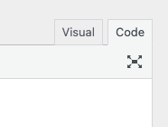

# Current Year Shortcode

By Weng Fei Fung (Weng).


<a target="_blank" href="https://github.com/Siphon880gh" rel="nofollow"></a>
<a target="_blank" href="https://www.linkedin.com/in/weng-fung/" rel="nofollow"></a>
<a target="_blank" href="https://www.youtube.com/@WayneTeachesCode/" rel="nofollow"></a>

Current Year Shortcode adds a simple shortcode to display the current year. This is useful for copyright notices, footers, or any content where you want to automatically display the current year without manually updating it every year.

## Features

* Simple `[WF_YEAR]` shortcode
* Automatically displays the current year
* Lightweight and fast
* No configuration needed
* Developer-friendly with filter hooks

## Usage

Simply add `[WF_YEAR]` anywhere in your posts, pages, or widgets, and it will be replaced with the current year (e.g., 2025). You may want to switch to Code tab:



**Example:**
```
Copyright © [WF_YEAR] Your Company Name
```
Will display as (if the current year is 2025):
```
Copyright © 2025 Your Company Name
```

## Installation

1. Upload the plugin files to the `/wp-content/plugins/wf-year-shortcode` directory, or install the plugin through the WordPress plugins screen directly.
2. Activate the plugin through the 'Plugins' screen in WordPress.
3. Use the `[WF_YEAR]` shortcode in your posts, pages, or widgets.

## Developer Information

**Hooks:**
* `wf_year_shortcode_year` - Filter to modify the year output

**Functions:**
* `WF_Year_Shortcode::get_current_year()` - Static method to get current year

For more information and support, please visit the plugin's repository or contact the developer.

## Frequently Asked Questions

**Q**: How do I use the shortcode?
**A**: Simply type `[WF_YEAR]` anywhere in your content where you want the current year to appear.

**Q**: Does the year update automatically?
**A**: Yes! The shortcode will always display the current year based on your server's time zone.

**Q**: Can I customize the output?
**A**: Developers can use the `wf_year_shortcode_year` filter to customize the output:

```php
add_filter('wf_year_shortcode_year', function($year) {
    return 'Copyright © ' .  $year . ' Your Company. All rights reserved.';
});
```

**Q**: Is this plugin compatible with page builders?
**A**: Yes, the shortcode works with most page builders that support WordPress shortcodes.